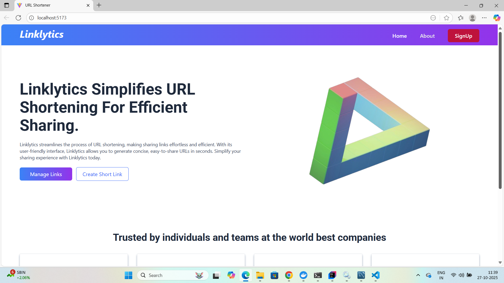
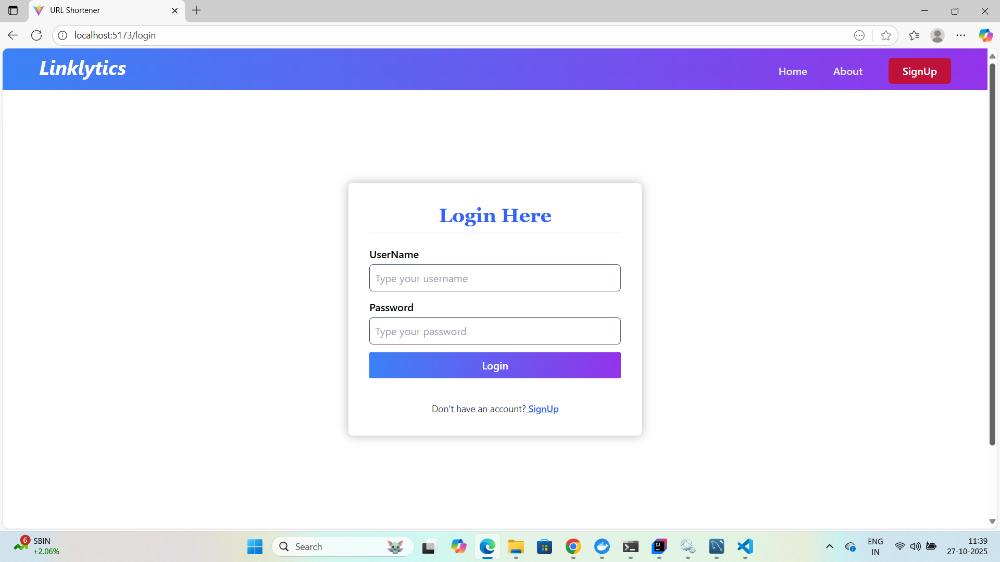
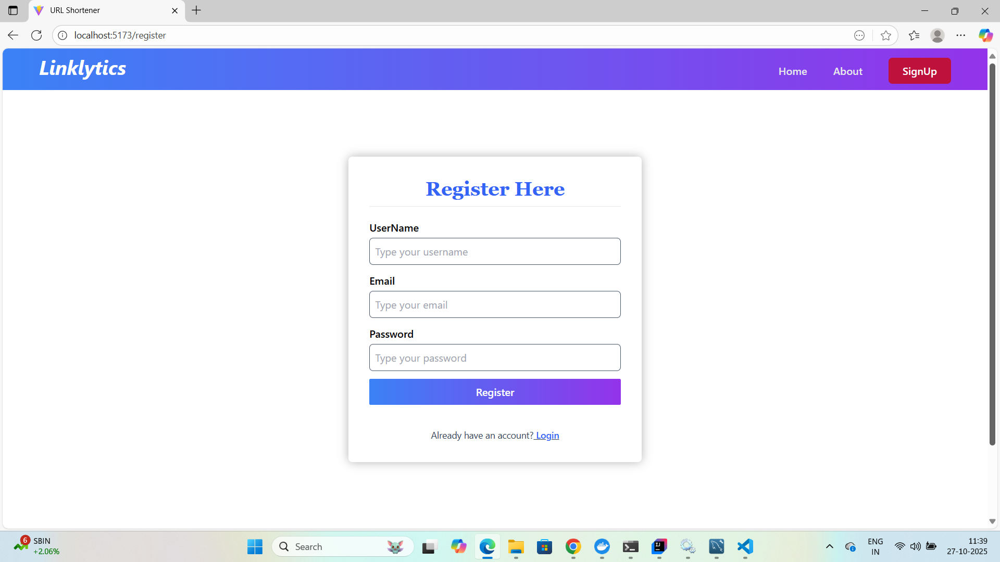
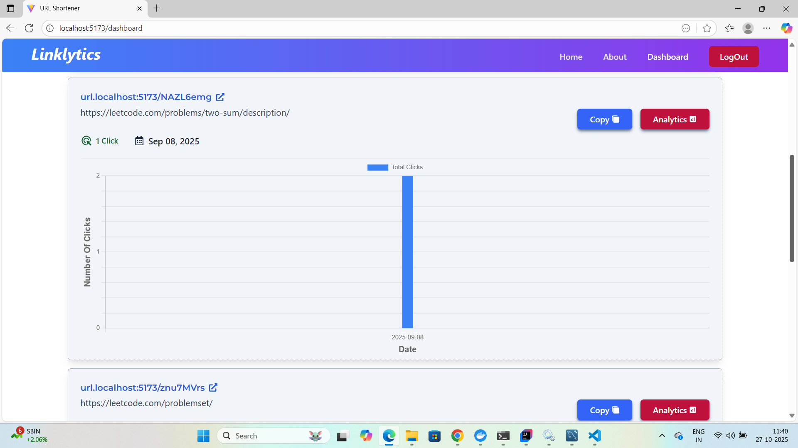
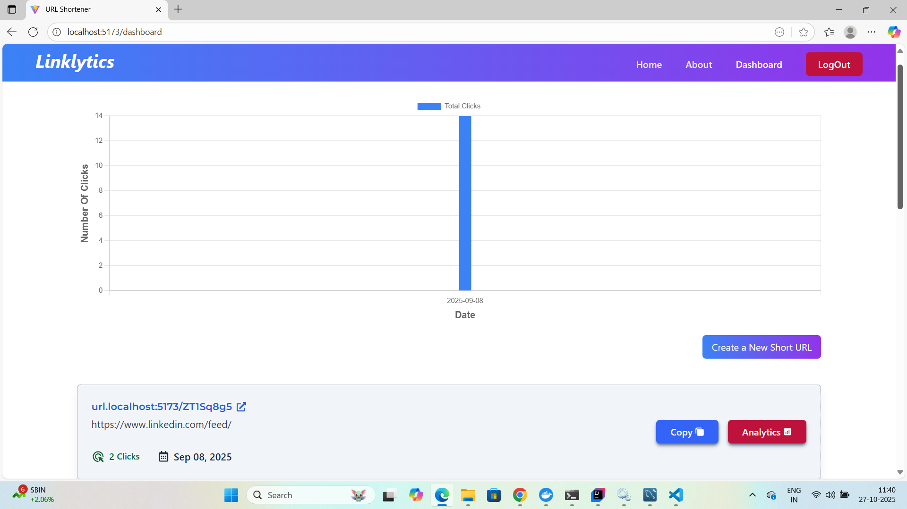
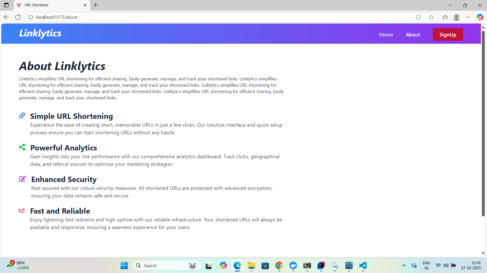

# URL Shortener

This is a **URL shortener** built with **Spring Boot** implementing **RESTful APIs**,
**JWT-based authentication**, URL redirection, and Click analytics to provide actionable usage insights.

It has a **React** frontend made using React Router, Hook Forms, Axios,
**TailwindCSS**, and **Material-UI** for styling delivering a responsive,
intuitive user experience with seamless API integration and instant feedback.

